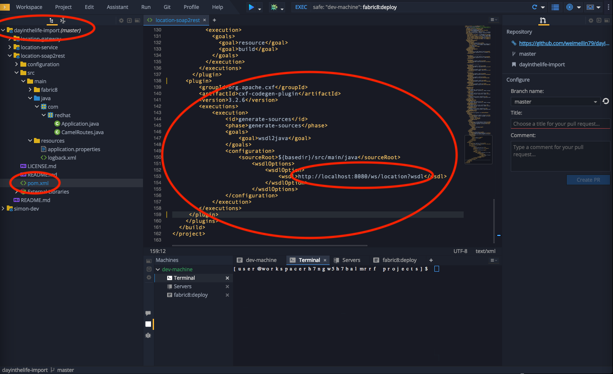
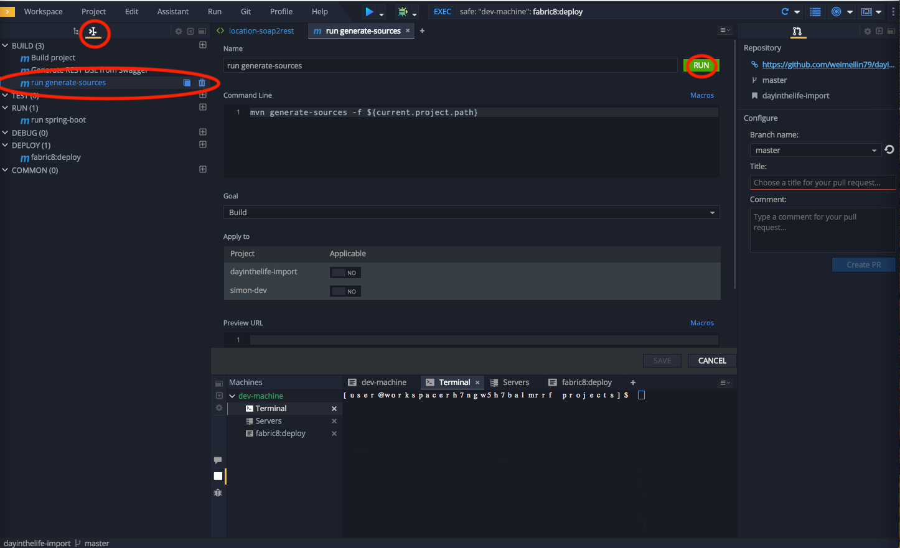
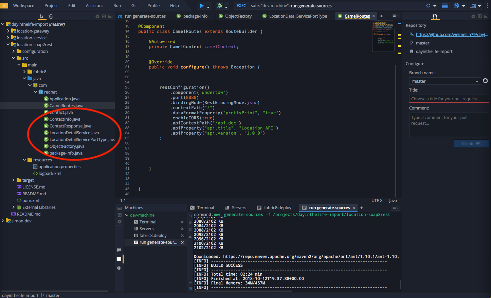
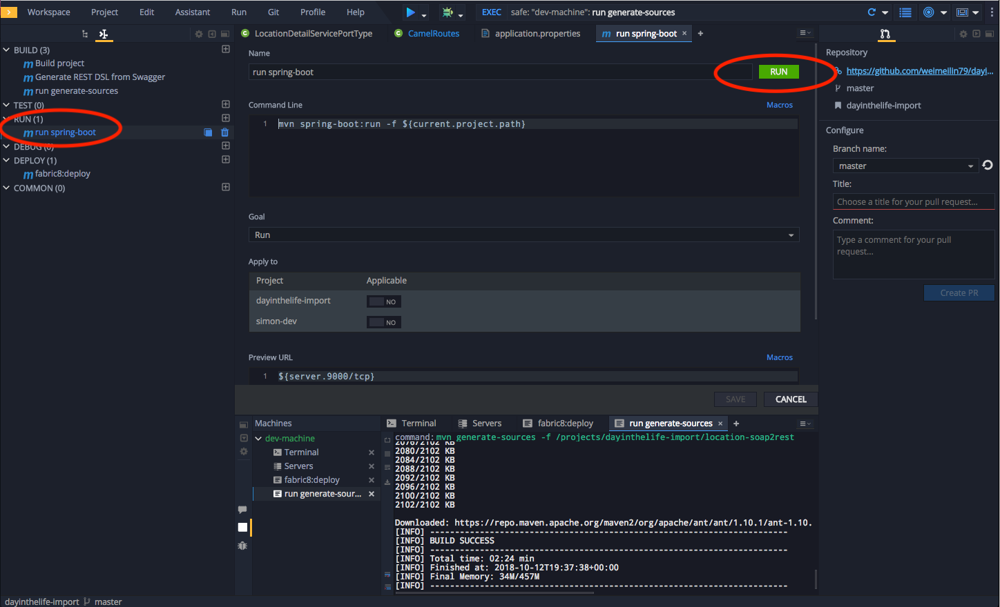
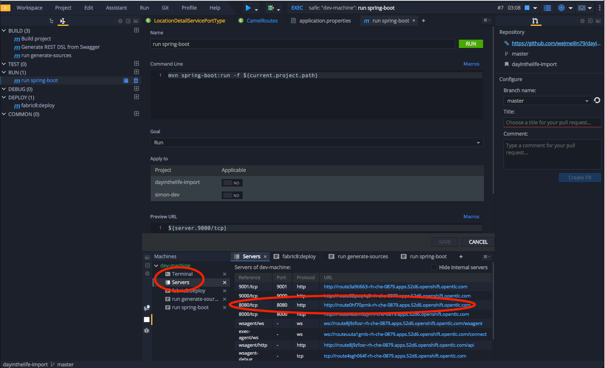
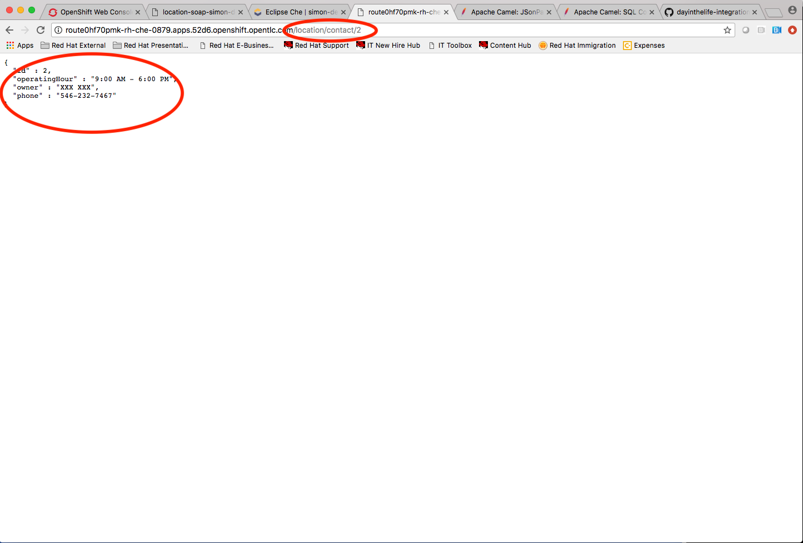
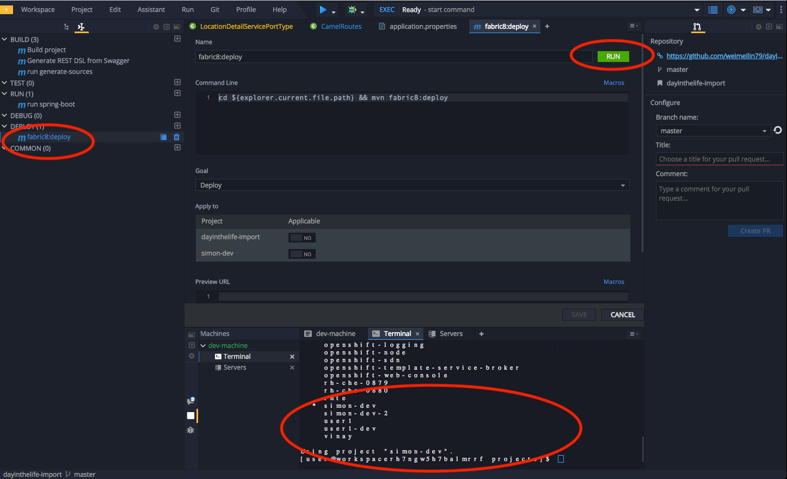
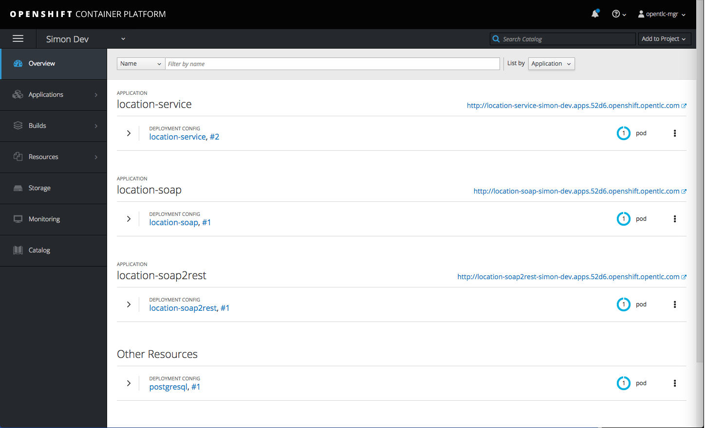

# Lab 4

## SOAP to REST

### Contract-first API development wrapping an existing SOAP service, implemented using Eclipse Che

* Duration: 20 mins
* Audience: Developers and Architects

## Overview

Another important use case in developing API's is to take an existing legacy SOAP service and wrap it with a new RESTful endpoint.  This SOAP to REST transformation is implemented in the API service layer (Fuse).  This lab will walk you through taking an existing SOAP contract (WSDL), converting it to Java POJO's and exposing it using Camel RESTdsl.

### Why Red Hat?

Eclipse Che, our online IDE, provides important functionality for implementing API services. In this lab you can see how our Eclipse Che and Fuse can help with SOAP to REST transformation on OpenShift.

### Skipping The Lab

We know sometimes we don't have enough time to go over the labs step by step. So here is a [short video](https://youtu.be/CjmO7v3o5dA) where you can see how to implement a SOAP to REST transformation API.

If you are planning to follow to the next lab or are having trouble with this lab, you can reference the working project [here](https://github.com/RedHatWorkshops/dayinthelife-integration/tree/master/projects/location-soap2rest)

### Environment

Open a browser window and navigate to `http://che-rh-che-0879.apps.GUID.openshift.opentlc.com/dashboard/#/`.  *Remember to replace the GUID with your [environment](#environment) value and your user number.*. Please re-use the Workspace you used during Lab04.

## Lab Instructions

### Step 1: Modify the skeleton location-soap2rest project

1. In the OpenShift console, click on the route associated with the `location-soap` deployment.  A pop-up will appear.  Append the `/ws/location?wsdl` path to the URI and verify the WSDL appears. Copy the link to the clipboard.

    

1. Return to your Eclipse Che workspace and open the `dayintelife-import/location-soap2rest` project.  Open the `pom.xml` file and scroll to the bottom.  Uncomment out the `cxf-codegen-plugin` entry at the bottom.  Update the `<wsdl>` entry with your fully qualified WSDL URL e.g. `http://location-soap-simon-dev.apps.52d6.openshift.opentlc.com/ws/location?wsdl`.

    

1. We now need to generate the POJO objects from the WSDL contract.  To do this, change to the **Manage commands** view and double-click the `run generate-sources` script.  Click **Run** to execute the script.

    

1. Once the script has completed, navigate back to the **Workspace** view and open the `src/main/java/com/redhat` folder.  Notice that there are a bunch of new POJO classes that were created by the Maven script.

    

1. Open up the `CamelRoutes.java` file.  Notice that the existing implementation is barebones. First of all, we need to enter the SOAP service address and WSDL location for our CXF client to call.  Secondly, we need to create our Camel route implementation and create the RESTful endpoint.  To do this, include the following code (making sure to update the GUID and username values in the `to("cxf://` URL):

    ```java
	
	...

	@Autowired
	private CamelContext camelContext;
	
	private static final String SERVICE_ADDRESS = "http://localhost:8080/ws/location";
	private static final String WSDL_URL = "http://localhost:8080/ws/location?wsdl";

	@Override
	public void configure() throws Exception {
	
	...	
	
		rest("/location").description("Location information")
			.produces("application/json")
			.get("/contact/{id}").description("Location Contact Info")
				.responseMessage().code(200).message("Data successfully returned").endResponseMessage()
				.to("direct:getalllocationphone")
			
		;
		
		from("direct:getalllocationphone")
			.setBody().simple("${headers.id}")
			.unmarshal().json(JsonLibrary.Jackson)
			.to("cxf://http://location-soap-userX.apps.GUID.openshiftworkshop.com/ws/location?serviceClass=com.redhat.LocationDetailServicePortType&defaultOperationName=contact")
			
			.process(
					new Processor(){

						@Override
						public void process(Exchange exchange) throws Exception {
							//LocationDetail locationDetail = new LocationDetail();
							//locationDetail.setId(Integer.valueOf((String)exchange.getIn().getHeader("id")));
							
							MessageContentsList list = (MessageContentsList)exchange.getIn().getBody();
							
							exchange.getOut().setBody((ContactInfo)list.get(0));
						}
					}
			)
			
		;
	
	    }
	}
    ```

1. Now that we have our API service implementation, we can try to test this locally.  Navigate back to the **Manage commands** view and execute the `run spring-boot` script.  Click the **Run** button.

    
    
1. Once the application starts, navigate to the Servers window and click on the URL corresponding to port 8080.  A new tab should appear:

    

1. In the new tab, append the URL with the following URI: `/location/contact/2`.  A contact should be returned:

    

1. Now that we've successfully tested our new SOAP to REST service locally, we can deploy it to OpenShift.  Stop the running application by clicking **Cancel**.  Open the terminal and login using the `oc login` command and select your corresponding OCPPROJECT e.g. `oc project OCPPROJECT`.  Open the `fabic8:deploy` script and hit the **Run** button to deploy it to OpenShift.

    


1. If the deployment script completes successfully, navigate back to your OCPPROJECT web console and verify the pod is running

    

1. Click on the route link above the location-soap2rest pod and append `/location/contact/2` to the URI.  As a result, you should get a contact back.


*Congratulations!* You have created a SOAP to REST transformation API.

## Summary

You have now successfully created a contract-first API using a SOAP WSDL contract together with generated Camel RESTdsl.

You can now proceed to [Lab 5](../lab05/#lab-5)

